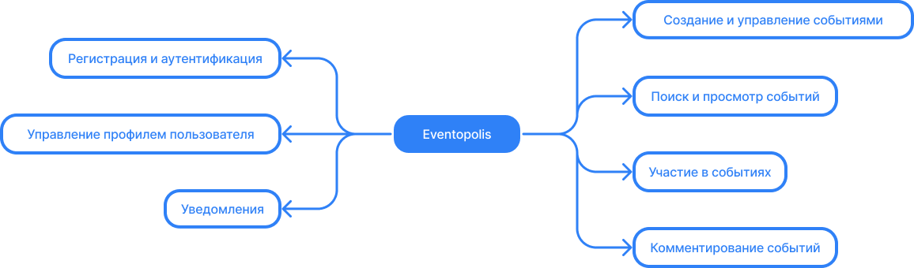

# Eventopolis — Городской гид по захватывающим мероприятиям!

### Цель проекта
Цель проекта - связать организаторов и участников событий и предоставить удобный инструментарий для управления и поиска мероприятий.

### Описание проекта
«Eventopolis» — это веб-приложение для организации и управления событиями.
Оно предоставляет пользователям возможность создавать, просматривать и присоединяться к различным событиям, таким как концерты, выставки и встречи.

### Функциональные требования

#### 1. Регистрация и аутентификация
- В качестве имени пользователя (username) должна быть использована электронная почта (email).
- Подтверждение адреса электронной почты при регистрации, путём оправки пользователю письма со ссылкой подтверждения.
- Возможность восстановления пароля на странице авторизации через электронную почту.

#### 2. Управление профилем пользователя
- Возможность изменения данных профиля (имя, фамилия, email, Telegram username, изображение).
- Возможность изменения пароля с подтверждением старого пароля.
- Возможность включения и отключения уведомлений в Telegram.

#### 3. Создание и управление событиями
- Возможность создания событий с указанием места проведения через интегрированные карты (OpenStreetMap API).
- Управление созданными событиями: редактирование, удаление.

#### 4. Поиск и просмотр событий
- Просмотр всех событий на главной странице для всех пользователей.
- Просмотр событий, к которым пользователь присоединился, на отдельной странице для аутентифицированных пользователей.
- Поиск событий с фильтрацией по категориям и дате на главной странице.

#### 5. Участие в событиях
- Возможность присоединения к событиям для аутентифицированных пользователей.
- Обновление количества участников события, после присоединения пользователя.

#### 6. Комментирование событий
- Возможность оставления комментариев под событиями для аутентифицированных пользователей.

#### 7. Уведомления
- Уведомления о предстоящих событиях через Telegram для пользователей, активировавших данную опцию.
- При активации уведомлений необходимо указать Username Telegram и выполнить активацию с помощью бота.

### Технические требования
- Реализация REST API при помощи Django REST framework.
- Интеграция с OpenStreetMap API для указания и отображения места проведения событий.
- Интеграция с Telegram API для отправки уведомлений о событиях.
- Развертывание приложения на хостинге Heroku для публичного доступа.

### Entity-relationship model

### Путь пользователя

### Дизайн и пользовательский интерфейс
- Отзывчивый дизайн, поддерживающий работу на различных устройствах и экранах.

### Предварительный стек технологий
**Backend:**
- Python 3.11
- Django 4.2
- Django REST framework 3.14
- PostgreSQL

**Frontend:**
- JavaScript
- HTML
- CSS
- Bootstrap 5.3
